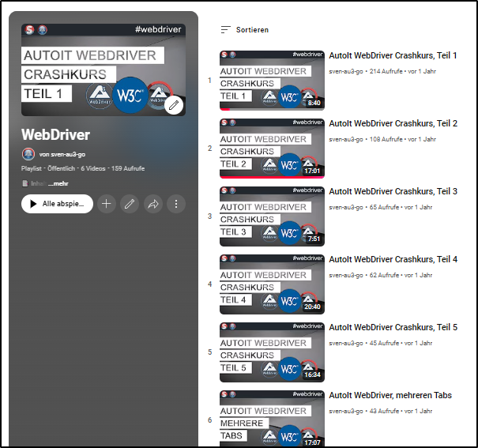

#####

<p align="center">
    
    <h2 align="center">Welcome to <code>autoit-webdriver-boilerplate</code>【ツ】</h2>
</p>

[](https://github.com/sven-seyfert/autoit-webdriver-boilerplate/blob/main/LICENSE.md)
[](https://github.com/sven-seyfert/autoit-webdriver-boilerplate/releases/latest)
[]()
[]()
[](https://github.com/sven-seyfert/autoit-webdriver-boilerplate/commits/main)
[](https://github.com/sven-seyfert/autoit-webdriver-boilerplate/graphs/contributors)
[](https://discord.gg/5DWTpZK3QN)

---

[Description](#description) | [Features](#features) | [Getting started](#getting-started) | [Configuration](#configuration) | [Contributing](#contributing) | [License](#license) | [Acknowledgements](#acknowledgements)

## Description

The project "autoit-webdriver-boilerplate" can be used as quick entry point for the awesome [au3WebDriver](https://github.com/Danp2/au3WebDriver/) project by @Danp2 (and @mlipok). The intention is, give people a easy start with WebDriver for AutoIt.

## Features

#### *Branches*

The different kinds of **examples**, are (and will be) separated in different branches of the repository. In this overview you basically can see which branch contains which example of WebDriver actions. Some examples and their code could be implemented in a shorter way, but this is made by design and follows a educational purpose.

1️⃣ In case of 🔴 broken examples, I try to fix them as soon as possible.<br>
2️⃣ Sometimes Google restricts actions 🟡 on their pages (e.g. google search, google translator), so it's not always feasible to address all needs, in all supported browsers.

| Branch                      | Description of the<br>WebDriver actions                                                                                                                | Test<br>Chrome                      | Test<br>Firefox                       | Test<br>MSEdge                      | Browser automation<br>flow (steps)                                                                                                  | Websites in use                                                                                                                                                        |
| ---                         | ---                                                                                                                                                    | :---:                               | :---:                                 | :---:                               | ---                                                                                                                                 | ---                                                                                                                                                                    |
| `main`                      | No steps/actions (only the boilerplate template code).                                                                                                 | 2025-08-31<br>🟢<br>v139.0.7258.155 | 2025-08-31<br>🟢<br>v142.0.1.723      | 2025-08-31<br>🟢<br>v139.0.3405.125 | [jump to steps](https://github.com/sven-seyfert/autoit-webdriver-boilerplate/blob/main/src/website-steps-handler.au3)              | https://www.w3schools.com/                                                                                                                                             |
| `get-table-texts`           | 1. open website; 2. confirm cookie consent dialog; 3. navigate between pages; 4. get table texts                                                       | 2025-08-31<br>🟢<br>v139.0.7258.155 | 2025-08-31<br>🟢<br>v142.0.1.723      | 2025-08-31<br>🟢<br>v139.0.3405.125 | [steps](https://github.com/sven-seyfert/autoit-webdriver-boilerplate/blob/get-table-texts/src/website-steps-handler.au3)           | https://www.w3schools.com/                                                                                                                                             |
| `fill-form-take-screenshot` | 1. open website; 2. navigate to specific area; 3. fill a form; 4. take screenshots                                                                     | 2025-08-31<br>🟢<br>v139.0.7258.155 | 2025-08-31<br>🟢<br>v142.0.1.723      | 2025-08-31<br>🟢<br>v139.0.3405.125 | [steps](https://github.com/sven-seyfert/autoit-webdriver-boilerplate/blob/fill-form-take-screenshot/src/website-steps-handler.au3) | https://demoqa.com/                                                                                                                                                    |
| `google-search`             | 1. open website; 2. confirm cookie consent dialog; 3. enter search query; 4. choose specific match by text                                             | 2025-08-31<br>🟢<br>v139.0.7258.155 | 2025-08-31<br>🟡<br>v142.0.1.723 [^1] | 2025-08-31<br>🟢<br>v139.0.3405.125 | [steps](https://github.com/sven-seyfert/autoit-webdriver-boilerplate/blob/google-search/src/website-steps-handler.au3)             | https://www.google.de/                                                                                                                                                 |
| `multiple-browser-tabs`     | 1. open website; 2. open three more websites in separate browser tabs; 3. do actions (screenshots) for each tabs; 5. navigate through tabs, close tabs | 2025-08-31<br>🟢<br>v139.0.7258.155 | 2025-08-31<br>🟢<br>v142.0.1.723      | 2025-08-31<br>🟢<br>v139.0.3405.125 | [steps](https://github.com/sven-seyfert/autoit-webdriver-boilerplate/blob/multiple-browser-tabs/src/website-steps-handler.au3)     | https://github.com/sven-seyfert/autoit-webdriver-boilerplate<br><br>https://www.autoitscript.com/wiki/WebDriver#FAQ<br><br>https://autoit.de<br><br>https://pkg.go.dev |

[^1]: The google search, cannot be automated with Firefox in the shown way. Firefox does not provide similar capability options like "excludeSwitches > enable-automation" or argument "--disable-blink-features=AutomationControlled" which set chromium based drivers into accepted automation mode. In case you don't set these options (switches) you cannot deal with some Google sites.

#### *WebDriver actions function list*

In file `.\src\common\webdriver-actions-handler.au3` you can find the following functions which should help you in terms of browser automation actions. These functions are used in the different branches and especially in the `_Steps()` function and their subfunctions (entry point of the browser automation).

| Area         | Function                             | Purpose                                                                                           |
| ---          | ---                                  | ---                                                                                               |
| `Navigation` |                                      |                                                                                                   |
|              | _NavigateTo($sUrl)                   | Open the specific URL.                                                                            |
|              | _OpenNewTab()                        | Open new tab and switch to the newly created tab context.                                         |
|              | _PreviousTab()                       | Switch to previous (left) tab with context switch.                                                |
|              | _NextTab($bShouldClose = False)      | Switch to next (right) tab with context switch.                                                   |
|              | _CloseTab()                          | Close current active tab and switch to next (right) tab, with context.                            |
|              | _BrowserBack()                       | Make a browser history back action (backward arrow).                                              |
|              | _GetCurrentBrowserTabHandle()        | (internal) Get the active browser tab handle, to deal with tab navigation.                        |
|              | _GetBrowserTabHandles()              | (internal) Get handles of all browser tabs, to deal with tab navigation.                          |
|              | _SwitchTab($sHandle)                 | (internal) Switch to tab handle context.                                                          |
| `Elements`   |                                      |                                                                                                   |
|              | _ExistsElement($sSelector)           | Returns the boolean statement about whether an element exists or not.                             |
|              | _FindElement($sSelector)             | Get element id (UUID) which is necessary to interact with the DOM elements.                       |
|              | _FindElements($sSelector)            | Get a list of elements (of UUIDs) for further interactions (see "_FindElement").                  |
|              | _ClickElement($sSelector)            | Click DOM element by selector.                                                                    |
|              | _GetElementText($sSelector)          | Get the text of the specific DOM element.                                                         |
|              | _GetElementsTexts($sSelector)        | Get a list of texts of the specific DOM elements.                                                 |
|              | _SetElementText($sSelector, $sValue) | Set text to a element like an input field.                                                        |
|              | _WaitForVisible($sSelector)          | Wait until a element is visible.                                                                  |
| `Screenshot` |                                      |                                                                                                   |
|              | _TakeScreenshot()                    | Create a screenshot of the whole browser window and save this screenshot in the output directory. |
|              | _TakeElementScreenshot($sSelector)   | Create a screenshot of a specific area/element and save this screenshot in the output directory.  |
|              | _CreateScreenshotFile($sResponse)    | (internal) Write screenshot data to output directory.                                             |
| `iFrames`    |                                      |                                                                                                   |
|              | _EnterIFrame($sSelector)             | Move context to an iFrame.                                                                        |
|              | _LeaveIFrame()                       | Leave the context of the previous entered iFrame (move out).                                      |

## Getting started

#### *Preconditions*

As assumption, your "browser" of choice which should be automated, have to be installed on your system. Not the "driver" (chromedriver.exe, geckodriver.exe etc.), your browser.

#### *Installation*

Fork or clone the repository. Alternatively you can download the [latest release](https://github.com/sven-seyfert/autoit-webdriver-boilerplate/releases/latest) package. That should be all 😀 .

*Q: How to clone a specific branch?*<br>
*A: If you want to get the "multiple-browser-tabs" branch, simply use*

```
git clone --branch multiple-browser-tabs https://github.com/sven-seyfert/autoit-webdriver-boilerplate.git`
```

#### *Usage*

Open the project in your editor/IDE and navigate to folder `.\src`. Open `main.au3`, check and adjust the values of function `_SetGlobalValues()` and run the program. By default, in case you fulfill the [preconditions](#preconditions), the driver should start and should execute some simple webdriver actions like described in the [features](#features) section (for the specific branch).

Adjust the `_Steps()` function content in `.\src\website-steps-handler.au3` to your requirements and goals. Use the prepared wrapper functions in `.\src\common\webdriver-actions-handler.au3` and in as best case, you also want to follow the POM (page object model) structure like prepared too.

🎬 A **video crash course** on how to use this project is available on Youtube, see playlist [WebDriver](https://www.youtube.com/playlist?list=PLDoYN-7Uor1AytcGNReTw5aqdUz1OMARR). The videos are **in german**, but ⚠ I plan to recreate them in english too.

[](https://www.youtube.com/playlist?list=PLDoYN-7Uor1AytcGNReTw5aqdUz1OMARR)

## Configuration

Adjust the content/values of function `_SetGlobalValues()` in `.\src\main.au3`.

``` autoit
Func _SetGlobalValues()
    $mConfig.Driver            = 'firefox' ; chrome|firefox|msedge
    $mConfig.IsHeadlessMode    = False     ; False|True
    $mConfig.IgnoreSSLAndCerts = False     ; False|True
    $mConfig.LocatorStrategy   = Null      ; will be set in function "_SetLocatorStrategy()", default is XPath
    $mConfig.Delay             = 300       ; delay for supporting a robust waiting behavior (page load, clicks, texts etc.)
    $mConfig.BrowserWidth      = 1600      ; or 1920, etc.
    $mConfig.BrowserHeight     = 900       ; or 1080, etc.
    $mConfig.BrowserMode       = 'size'    ; fullscreen|maximize|size (default is 'size' which applies .BrowserWidth and .BrowserHeight)

    ; This is the default installation path, change this in case it's another on your system.
    $mConfig.FirefoxBinary = 'C:\Program Files\Mozilla Firefox\firefox.exe'

    ; Shutdown webdriver on find element error (default is True).
    $mConfig.TeardownOnFindElementError = True

    ; No shutdown of the webdriver on end of the execution (default is False).
    ; If set to "True", the browser keeps open, but you have to close the
    ; driver console manually in this case, to shutdown the driver session
    ; which close the browser.
    $mConfig.NoTeardownOnEnd = False
EndFunc
```

## Contributing

I really appreciate 😀 any kind of suggestions, recommendations, ideas and of course BUG reports on GitHub via **Issues**. Don't hesitate to open up an issue and let's discuss the possibilies.

Otherwise **fork** the repository (project), create a feature branch and then create a **pull request** (PR) to be merged. I try to review the PR as soon as possible.

It would be great if you:
- Try to stick to the commit schema you see in the commit history.
- Try to structure your code as readable and clean as possible, because it's important to me to have maintainable code in the repository. However, I'll be happy to discuss these aspects with you in a PR if needed.
- The **CHANGELOG.md** file don't has to be adjusted by you. I will add your commit(s) their by an automatism when it comes to merge the PR.
- Don't forget to adjust the **README.md** file, in case it's necessary.

Thank you for your contribution 🤝 .

## License

Copyright (c) 2025 Sven Seyfert (SOLVE-SMART)<br>
Distributed under the MPL-2.0 License. See [LICENSE](https://github.com/sven-seyfert/autoit-webdriver-boilerplate/blob/main/LICENSE.md) for more information.

## Acknowledgements

- Opportunity by [GitHub](https://github.com)
- Badges by [Shields](https://shields.io)
- Thanks to the authors, maintainers and contributers of the various projects and UDFs
  - lib/au3WebDriver/wd_*.au3 by [@Danp2](https://github.com/Danp2) and [@mLipok](https://github.com/mLipok) ([License: MIT](lib/au3WebDriver/MIT.md))
  - lib/json/*.au3 by @Ward, @Jos and @TheXMan ([License: Unlicense](lib/json/Unlicense.md))
  - lib/winHttp/*.au3 by [@dragana-r](https://github.com/dragana-r) (@trancexx) ([License: Apache-2.0](lib/winHttp/Apache-2.0.md)) [^2]

[^2]: See [additional license note](https://github.com/sven-seyfert/autoit-webdriver-boilerplate/blob/main/lib/winHttp/additional-license-note.txt) from Dragana R.

##

[To the top](#)
